```{r setup, include=FALSE}
#| warning: false
#| message: false

library(flextable)
library(tidyverse)

knitr::opts_chunk$set(
  echo = FALSE,
  warning = FALSE,
  message = FALSE,
  fig.align = 'center',
  out.width = '80%'
)
```

```{=tex}
\begin{center}
{\LARGE\textbf{Costly Regulation, Minimal Results: The EU's Deforestation Regulation Effect on Global Soy Trade}\footnote{This is my first job market paper. Preprint. Comments are welcome. I would like to thank Professors Jeff Luckstead, Stephen Devadoss, and participants of the AAEA Conference 2025 in Denver, Colorado, and K-State Risk and Profit Conferences for their comments, suggestions and support. All errors are my own.}}

\vspace{1cm}

{\large\textbf{Manoj Sharma}\footnote{PhD Candidate, Department of Agricultural Economics, Kansas State University. Email: \href{manoj55@ksu.edu}{manoj55@ksu.edu}}}
{\large\textbf{Nelson Villoria}\footnote{Professor, Department of Agricultural Economics, Kansas State University. Email: \href{nvilloria@ksu.edu}{nvilloria@ksu.edu}}}

\vspace{0.5cm}

{\large November 2025}

{\href{https://manoj55.quarto.pub/manoj55/March-22-Essay-1.pdf}{Click here for the latest version.}}

\par
\href{https://manoj55.quarto.pub/global_effect.pdf}{Click here for second job-market paper}

\end{center}
```

```{=tex}
\begin{center}
\textbf{Abstract}
\end{center}
```

The European Union Deforestation Regulation (EUDR) aims to reduce deforestation by 
restricting market access to soy products that are deforestation-embodied in the EU market. The 
primary concern is that such restrictions could shift the soy trade to unregulated markets. To shed 
light on this issue, we employ a gravity model, treating the EUDR compliance costs as additional 
trade costs for exports to the EU. We find that stricter compliance costs reallocate soy exports 
from South America toward non-EU markets, mainly China, and divert the EU imports towards 
North America. Under the counterfactual scenario in which South America does not comply with 
the regulation, EU consumers face even larger price increases, while South American countries 
experience minimal terms-of-trade losses. Our analysis suggests that trade reallocation to an 
unregulated market could potentially dilute the impact of the EUDR, making it less effective in 
directly reducing deforestation linked to soy production.

**JEL-Codes**: Q17, Q56, F18

**Keywords**: EUDR, Structural gravity model, Deforestation, Soy, Tariffs

\newpage

# Introduction

The European Union Deforestation Regulation (EUDR) prohibits the trade of seven commodities (including their derivatives)—namely, palm oil, cattle, soy, cocoa, coffee, rubber, and wood—collectively known as forest risk commodities (FRCs), in the EU market unless they meet three criteria: being deforestation-free, compliant with source country legislation, and covered by a due diligence statement [@european2023]. These requirements act as a non-tariff measure (NTM) to trade with an environmental objective by imposing deforestation-free production and traceability obligations on suppliers- a very similar NTM under the WTO's Technical Barriers to Trade (TBT)/ Sanitary and Phytosanitary (SPS) agreements. The regulation supports the EU's international climate change commitments, such as the EU Green Deal and the Paris Agreement. The implementation of the EUDR is anticipated to reduce tropical deforestation by 71.92 thousand hectares per year (the equivalent of ~101 thousand football pitches, which is 0.72% of annual global deforestation), avoiding the emissions of 32 million tons of carbon per year (~0.09% of annual global emissions) [@kpmg2023].

The EUDR can also inherit the well-documented ambiguity of NTM's trade effects. Technical barriers can either disrupt or facilitate trade, with effects being heterogeneous across products, measure types, country-pairs, and even with empirical design [@li2012; @santeramo2019]. In particular, regarding environmental technical measures in food and agricultural products, several multi-country evidence points towards trade reducing effects [@santeramo2019; @fontagne2005]. Globally, the environmental TBTs have been expanding rapidly, increasing the coverage of 3% to 16% of world trade between 2010 and 2020, and on average, reducing trade with effects varying by sector and exporter characteristics [@santeramo2025]. Together, this motivates understanding EUDR compliance in the context of a technical barrier that can have potentially sizable and heterogeneous effects across soy products and trading partners.

Beyond trade effects, the EUDR's unilateral and market access reduction approach to curb deforestation has raised concerns about its effectiveness. The studies of climate policy and environmental trade policies have consistently shown that the carbon and market leakage effects, whether occurring within or across borders, undermine policy effectiveness, creating tension between environment and trade goals [e.g., @aichele2015; @shapiro2021; @villoria2022]. In the soy sector, @villoria2022 reveal that within-border displacement of deforestation is a notable risk in Brazil, as exports exposed to restrictions in one sub-region shift deforestation pressures elsewhere within the country. More broadly, the global commodity market often reallocates deforestation pressure, particularly when relatively smaller destination markets implement regulatory measures [@muradian2025]. Given that the EUDR is a new regulation, it is important to assess whether its market access restrictions can truly reduce deforestation.

We analyze the impact of the proposed EU trade restrictions on the soy sector, using separate gravity models of soybeans, soybean oil, and soybean cake. We focus on the soy sector because (i) soybean expansion is an important driver of deforestation in South America, particularly Brazil [@song2021]; (ii) the EU is the second-largest global importer of soybeans, accounting for 9.88% of global exports, and the largest importer of soybean meals—which constitutes 23.82% of global soy trade—with approximately 24% of global exports [@comtrade2024]; (iii) the EU's consumption accounts for 32.80% of the deforestation associated with soybean production [@pendrill2022; @european2023]. We estimate the trade elasticity of each product and simulate the EUDR implementation by modeling the EUDR compliance costs as increased trade frictions, consistent with the NTM literature's treatment of technical measures as ad valorem tariff-equivalent frictions [e.g., @fontagne2005; @santeramo2019; @santeramo2025]. We develop two scenarios: one in which all countries comply with the EUDR, and another in which three major deforestation-risk countries- Brazil, Argentina and Paraguay (BAP)- do not comply. These countries account for 59.3%, 6%, and 4.4% of deforestation-linked to soybean production, respectively [@persson2024]. We estimate the counterfactual trade flows under these scenarios using the procedure developed by @anderson2018, which holds supplies and expenditures constant while allowing domestic and bilateral trade to adjust in response to changes in multilateral resistances stemming from the compliance costs. This approach enables us to evaluate the EUDR's effects on trade flows and price indexes.

Three key findings emerge from our analysis. First, the EUDR is largely ineffective at reducing soy exports from the focus countries. This is because the EU accounts for only a small share of exports from BAP (~8%), while demand from China is strong. Any entry restriction into the EU faced by BAP is offset by increased Chinese imports, while the EU can substitute with soy originating in the US and Canada. As a result, deforestation-embodied trade shifts from the EU to China. Second, the EU incurs a significant increase in soy prices, as much as 51%. In contrast, China and other Asian countries benefit from lower prices. Third, major exporters see no change in their terms of trade.

Our study makes two main contributions. First, we provide direct evidence of trade reallocation in the soy sector under the EUDR. Specifically, we show that soy trade shifts from the EU market to China, pointing towards little to no change in deforestation pressure and supporting the minimal cross-border leakage revealed by @villoria2022. Moreover, this points towards the domestic leakage patterns identified by @villoria2022 when sub-regions within a country (i.e., BAP) that are directly exposed to EU demand may shift deforestation pressure to sub-regions exposed to Chinese demand. This finding reinforces concerns raised in research [e.g., @aichele2015; @copeland2022; @villoria2022] about the limited effectiveness of unilateral trade policies covering relatively smaller markets. Second, our analysis highlights the broader challenges of using trade restrictions to achieve environmental goals, contributing to the literature of environmental-trade relations [@shapiro2021; @felbermayr2024]. This issue underscores two tensions in the multilateral trade system: concerns from deforestation-risk countries about the discriminatory nature of the EUDR restrictions, and policy trade-offs between environmental objectives and market access [@larch2017; @farrokhi2024]. The experience with the EU's REACH suggests that, over time, stringent European technical regulations can diffuse as trading partners harmonize to retain market access [@cha2021], but the short run is characterized by compliance burdens and trade reallocation; the very dynamics we document for soy under the EUDR. 

# The EUDR, the global soy market and implication to deforestation

The EUDR—Regulation (EU) 2023/1115 adopted on June 2023, and postponed to come into effect on December, 2025—repeals the EU Timber Regulation (EUTR) and goes beyond timber (wood) legality standards by including the six additional agricultural commodities (including their derivatives based on Harmonized System (HS) of classification): oil palm, cattle, soy, cocoa, coffee, and rubber [@european2023]. The EUDR prohibits the trade of products whose supply chain is linked to either deforestation or forest degradation and mandates due diligence for tracing the origin of their products and providing evidence that they are sourced from non-deforested land. The regulation applies directly to the soy processors and supply companies that must verify the lack of deforestation along the supply chain, using geospatial data, land tenure documents, and compliance records with local laws. Enforcement of the regulation is the responsibility of the EU member states, which must establish robust monitoring and evaluation mechanisms, requiring the companies to submit due diligence statements and maintain traceability throughout the supply chain. When companies are found to breach diligence statements, the member state can charge penalties up to at least 4% of the annual turnover, confiscate the soy products or revenue, impose a temporary exclusion from public procurement, and impose a temporary prohibition from placing soy products on the EU market. Further, member states will conduct checks based on the risk benchmarking of the country of origin, including document reviews and field inspections. For example, major soy-producing South American countries, such as Brazil, Argentina, Paraguay, and Bolivia, fall under the standard risk category, and the member states conduct compliance checks at least 3% of companies sourcing soy products from these countries annually.

Four soy products based on the HS codes are subject to the EUDR: HS 1201 (soybeans whether or not broken), HS 120810 (Soybean flour and meal), HS 1507 (Soybean oil and its fractions, whether or not refined, but not chemically modified) and HS 2304 (oilcake and other solid residues, whether or not ground or in the form of pellets, resulting from the extraction of soybean oil). Soybeans account for 64.91% (USD 90.97 billion) of these products, followed by 0.36%, 10.34%, and 24.39%, respectively.


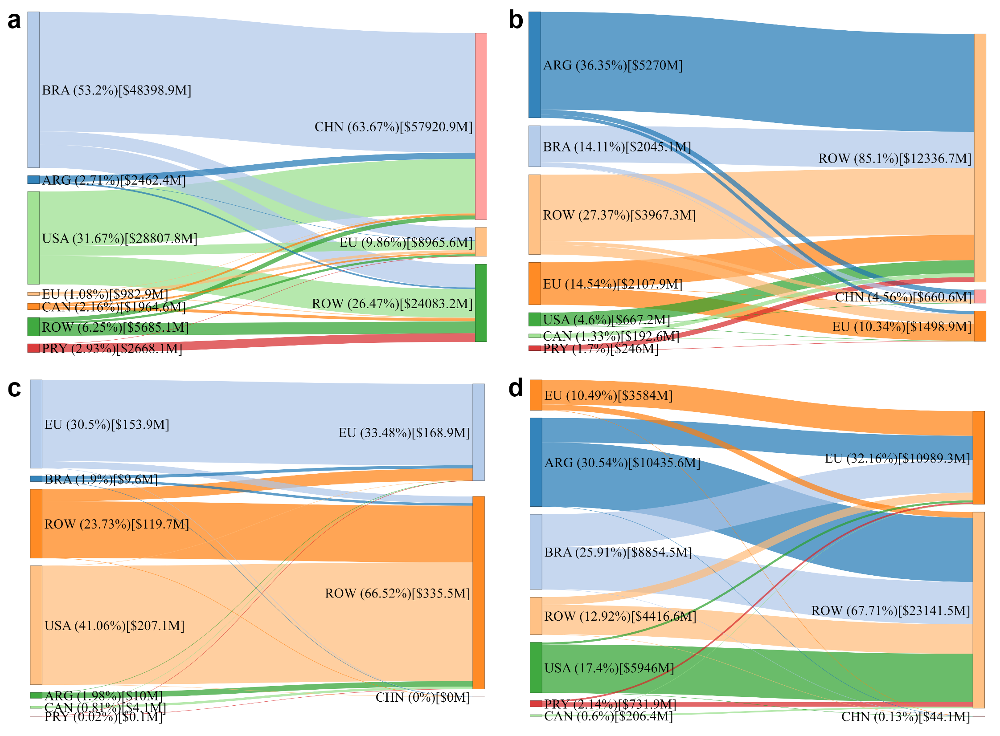

[Figure 1]{#fig1}: Global trade flows of soy market. (a) Soybean (HS1201) trade flow which share 64.91% of total soy trade. (b) Soybean oil (HS1507) trade flows which shares 10.34% of total soy trade (c) Soybean flour and meal (HS120810) trade flows which share 0.36% of total soy trade (d) Soybean oil cake (HS2304)  trade flows which shares 24.39% of total soy trade. Trade flows are based on cumulative values from 2021 to 2023. The values in the brackets represent the average export and import values over the same period. The left side of the plots indicates exporters, while the right side indicates importers.

Source: UN Comtrade Database [@comtrade2024]

The global soybean market is characterized by three important features: (1) The increased production of soybeans is largely attributed to expanded land area. Between 2010 and 2021, the global harvested area for soybeans increased by 20.59%, leading to an 18% rise in production. This growth was driven primarily by land expansion (85%) and, to a lesser extent, yield improvements (15%) [@cassman2020]. In Brazil, soybean production increased ninefold between 1990 and 2020, with much of this expansion occurring at the expense of natural ecosystems such as the Amazon and Cerrado [@umburanas2022; @fehlenberg2017]. (2) The global soybean market represents one of the largest and most concentrated agricultural commodity trades, dominated by three major players: the US, Brazil, and China [@gale2019]. Brazil and the US collectively account for over 80% of global soybean exports, while China alone imports more than 60% of global soybean imports, as illustrated in [figure 1](#fig1). Although a relatively minor player in raw soybean and soybean oil imports, at 9.88% and 10.34%, respectively, the EU remains the leading importer of the global soybean meal and oilcake market, representing 32.16% of the imports (see [table 4.1](#table41) for details on the EU's trade share). In addition, the soybean oil market is relatively fragmented than the soybean cake and soybeans market, balancing market leverage among multiple sources and destinations. (3) Few companies control the global soy supply chain [@heron2018; @gouveris2024]. In Brazil, six multinational corporations—Archer Daniels Midland (ADM), Bunge, Cargill, Louis Dreyfus Company (LDC), Glencore, and Amaggi—together were responsible for 56.6% of soy exports and 66.3% of export-related soy deforestation risk over 2008 and 2017 [@ermgassen2020]. These companies play a pivotal role in shaping supply chains and compliance with regulations.

The EUDR has faced criticism despite its aim to reduce tropical deforestation. Producer countries argue that the regulation is imposed unilaterally, ignoring their forest protection efforts [@vannoordwijk2025; @fisher2024]. The regulation's data-intensive compliance is a major challenge, especially for multinational companies that struggle to trace commodity origins. For instance, although about 95% of soy from the Amazon and Cerrado in 2020 was deforestation-free, verifying this for EU compliance remains difficult [@vasconcelos2023]. Similar administrative burdens for data verification of foreign emissions are a central concern in the EU's Carbon Border Adjustment Mechanism (CABM) debate [see @bellora2023], highlighting that data collection costs matter a lot for environmental-cum-trade regulations. Such rules may also exclude smallholder farmers, including indigenous and local communities, as collecting geospatial data and land-tenure documents is costly and complex [@burgi2023; @vannoordwijk2025; @fisher2024], with mapping costs estimated at $30–$40 per plot [@gilbert2024]. Finally, since the EU represents a small share of the global soybean market, its influence is limited. This could result in segregated supply chains, with compliant soy sent to the EU and non-compliant ones sold elsewhere, leading to no change in deforestation [@deoliveira2024; @agunity2023].


# Data and Empirical Strategy

## Data

To conduct empirical analyses, we construct a panel dataset for 90 countries (see [appendix A1](#app1)) covering 2007-2022. We choose this period because the data on effective applied tariffs are available only after 2007 onward and the bilateral and domestic sales data needed to construct intranational trade flows are available through 2022. Our data cover four key components: (i) international trade flows, (ii) intra-national trade flows, (iii) effectively applied tariffs, and (iv) standard gravity variables.

*International trade flows*. We compile a dataset on bilateral trade flows for soy products using
the CEPII-BACI database, which is recognized for its detailed and
reliable dataset. The BACI database offers several key advantages: (i)
it provides data at the product level, categorized using Harmonized
System (HS) codes, and (ii) it is more reliable than raw data from
Comtrade as it reconciles mirror figures to address discrepancies and
improve accuracy [@gaulier2010]. For soybeans, the data is constructed using HS code 1200100 for the
period before 2012, and HS codes 120110 and 120190 for the period from
2012 onward. Similarly, the trade flows for soybean oil are based on HS
codes 150710 and 150790, while those for soybean cake are based on HS
code 230400. 

*Intra-national trade flows*. Following @villoria2025trade, we estimate intranational trade quantity as production minus exports plus stock variation, using the FAOSTAT Food Balance Sheets database [@faostat2024]. We convert intranational trade quantities to values using prices from the World Bank’s Pink Sheet [@worldbank_pink]. Because the International Trade and Production Database for Estimation (ITPDE) [@larch2025] includes only soybean intranational trade flows, our soybean intranational trade values correlate with ITPDE’s at 0.95. 

*Effectively applied tariffs*. We use bilateral effectively applied tariff rates obtained
from the ITC MacMap database, which ensures accurate representation of
tariff rates applied to a particular import during the study period [@itc2024]. If a preferential tariff exists, it is used as the effectively applied tariff, otherwise the most favored nation (MFN) applied tariff is used. 

*Standard gravity variables*. In addition to trade and
tariff data, we include variables capturing geographic and
historical relationships between trading partners. These variables—such
as distance, shared language, contiguity, and colonial ties—are sourced
from CEPII’s gravity database, which is a standard reference for gravity
model analyses in international trade [@conte2023]. 

@tbl-summary presents summary statistics for our dataset, which covers 90 countries as both exporters and importers, resulting in 129600 observations. In our sample, average tariff rates are approximately 10.6% for soybeans, 8.8% for soybean oil, and 4.2% for soybean cake. @fig-tariff1 displays the average tariffs imposed by EU countries on major exporters from 2007 to 2022. Notably, EU tariffs on soybean and soybean cake imports from Brazil, Argentina, Paraguay, and the USA are zero, and tariffs on soybean oil are also very low. Additionally, about 2.9% of country pairs in the sample share a border, 8.2% share a common language, and 3% have colonial ties.

```{r}
#| label: tbl-summary
#| tbl-cap: "Summary statistics of variables used in the study"
library(tidyverse, flextable)

summary_stats <- readRDS("data/summary_table.rds")

ft <- flextable(summary_stats) %>%
  set_header_labels(
    Variable = "Variable",
    Mean = "Mean or proportion*",
    SD = "Standard Deviation",
    Minimum = "Minimum",
    Maximum = "Maximum"
  ) %>%
  align(j = 1, align = "left") %>%
  align(j = 2:5, align = "right") %>%
  theme_vanilla() %>%
  fontsize(size = 10, part = "all") %>%
  padding(padding = 4, part = "all") %>%
  add_footer_lines(
    "Notes: The total number of observations is 129600 (90 exporters * 90 importers * 16 years)."
  ) %>%
  set_table_properties(width = 1, layout = "autofit") %>%
  autofit()


ft
```

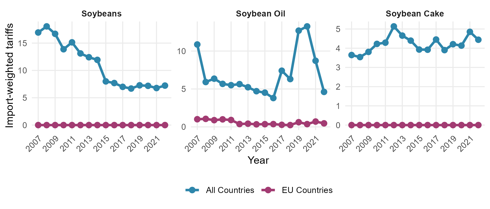{#fig-tariff1}

Source: Own illustration based on trade data from the BACI database [@gaulier2010]  and tariffs data from the ITC MacMap [@itc2024].

Note: The spikes in import-weighted tariffs for all countries for soybean oil in 2017–2020 reflect increased tariffs by India from 4% in 2016 to 36% in 2020.

## The EUDR simulation

We conduct the EUDR simulation by employing a conditional equilibrium framework based on @anderson2018. This approach estimates conditional counterfactuals that keep sales and expenditures of each country unchanged, with the change in trade pattern driven directly from compliance costs and indirectly from shifts in trade patterns with third countries via multilateral resistance terms (see [appendix A1.4](#app14) for the decomposition). Further, we model the EUDR as a destination-specific measure that raises the marginal cost of delivering soy from origin to the EU. As the legal obligation falls on ‘operators’ (importers, traders, and processors), these firm-level expenditures can be passed on to upstream and downstream depending on marketing structure, creating an effective ad valorem (iceberg) wedge on the EU-bounded flow. In a structural gravity framework, what matters for bilateral trade is this price wedge, which we represent in the form of ‘tariff-equivalent”. Our focus is the EUDR’s effectiveness in mitigating soybean-related deforestation by examining economic pressure faced by high-risk countries, particularly Brazil and other South American countries. If these countries experience unfavorable changes in export potential, price indexes, producer prices, and terms of trade, it suggests that compliance pressures can incentivize anti-deforestation practices. The methodology for measuring these effects is described below:

**Step 1: Estimation of Armington elasticities**

We estimate separate gravity models for soybeans, soybean oil, and soybean cake. Our empirical model employs the PPML-gravity specification (see [appendix 2](#str2) for details), as shown in below:

$$
X^s_{ijt} = \exp(\gamma^s_{it} + \gamma^s_{jt} + \gamma^s_{ij} + \gamma^s_1 \log(1 + \tau^s_{ijt})) \varepsilon^s_{ijt}, \quad \text{(1)}
$$

where $s$ indexes the soy products, with $s \in \{\text{soybean}, \text{soyoil}, \text{soycake}\}$. $X^s_{ijt}$  is the exports of soy products country $i$ to country $j$ at time $t$ and $\tau^s_{ijt}$ is the corresponding effectively applied ad valorem tariff rate. $\gamma_{it}$, $\gamma_{jt}$ and $\gamma_{ij}$ are exporter-year fixed effects, importer-year fixed effects and country-pairs fixed effects, respectively. The purpose of using effectively applied tariffs is two-fold: first, to estimate Armington elasticities; and second; to incorporate an ad valorem tariff‑equivalent of the EUDR compliance cost on the EU imports, which facilitates counterfactual computations in the absence of separate non‑tariff elasticities. Following @anderson2018 and @fontagne2022, the elasticity estimation of any price shifter (i.e. tariff) in the gravity model can be used to recover Armington elsticities which are $1-\gamma_1^s$ is our case. 

**Step 2: Estimation of baseline trade costs** 

Using the trade elasticities derived from equation (1), we estimate the country-pair fixed effects, exporter fixed effects, and importer fixed effects. We then fit these fixed effects, taking the base year 2022, as shown in equation 6. For the ease of notation, we omit product superscripts, $s$: 

$$X_{ij}=\exp(\tilde\gamma_1{\log}(1+\tau_{ij})+\tilde\gamma_{i}^{[BLN]}+\tilde\gamma_{j}^{[BLN]}+\tilde\gamma_{ij}^{[BLN]}). \quad \text{(2)}$$

Using the expenditure, sales and PPML fixed effects, we recover OMR and IMR consistent with the structural gravity terms, as demonstrated by @fally2015. The PPML ensures that the fixed effects adjust so that corresponding multilateral resistances are consistent with tariff elasticity. A unique feature of the PPML is that fitted expenditures (or sales) equal observed expenditures (sales), resulting in: 
$\sum_j \tilde{X}_{ij} = \sum_j X_{ij} = \tilde{Y}_i^{BLN}$ and $\sum_i \tilde{X}_{ij} = \sum_i X_{ij} = \tilde{E}_j^{BLN}$.  

To construct baseline OMR and IMR, we normalize all the fixed effects relative to Australia, denoted as $E_0$. According to @yotov2016, the reference country should be the one that is presumably not significantly affected by the counterfactual shock. This idea is to make the "relative" counterfactual changes in multilateral resistances closer to their "absolute" counterparts as possible. 

$$\tilde{[\Pi_i^{1-\sigma}]}^{BLN}=\frac{\tilde{E}_0}{\tilde{Y}_i}\exp(-\tilde{\gamma}_i^{[BLN]}), \quad \text{(3)}$$

$$\tilde{[P_j^{1-\sigma}]}^{BLN}=\frac{\tilde{E}_j}{\tilde{E}_0}\exp(-\tilde{\gamma}_j^{[BLN]}). \quad \text{(4)}$$

Practically, many country pairs involve zero trade flows. For such pairs, $\exp(\tilde{\gamma}_{ij})$ is not available. To recover the fixed effects of all country pairs, we conduct the regression using equation (5) for those with available country pair fixed effects. We then estimate all $\gamma$ parameters and predict $\exp(\tilde{\gamma}_{ij})$ for the missing country pair fixed effects.  

$$\exp(\tilde{\gamma}_{ij}) = \exp[\gamma_i+\gamma_j+\gamma_2\ln(DIST_{ij})+\gamma_3CNTG_{ij}+\gamma_4LANG_{ij}+\gamma_5CLNY_{ij}] \cdot \varepsilon_{ij}. \quad \text{(5)}$$

Therefore, the baseline trade cost is estimated as below:  

$$\tilde{[t_{ij}^{1-\sigma}]}^{BLN}=
\begin{cases}
\exp(\tilde{\gamma}_{ij}) \exp(\tilde{\gamma}_1\log(1+\tau_{ij})), & \text{if } X_{ij}>0 \text{ for at least one period,} \\
\tilde{\exp(\tilde{\gamma}_{ij})} \exp(\tilde{\gamma}_1\log(1+\tau_{ij})), & \text{if } X_{ij}=0 \text{ for all periods.}
\end{cases} \quad \text{(6)}$$

**Step 3: Construction of scenarios and counterfactuals** 

We estimate counterfactual trade costs by adding ad valorem tariff-equivalent to unilateral EUDR compliance costs on the tariffs for the exports to the EU countries in equation (6): 

$$\tilde{[t_{ij}^{1-\sigma}]}^{CFL}=
\begin{cases}
\exp(\tilde{\gamma}_{ij})\exp(\tilde{\gamma}_1\log(1+\tau_{ij}^{CFL})) \\
\tilde{\exp}(\tilde{\gamma}_{ij})\exp(\tilde{\gamma}_1\log(1+\tau_{ij}^{CFL})).
\end{cases} \quad \text{(7)}$$

where $\tau_{ij}^{CFL} = \tau_{ij} + EUDR\_AVE_{ij}$. Under the baseline condition of the year 2022, the $EUDR\_AVE_{ij}$ is zero, meaning there is no effect of the EUDR trade restriction. We model 
EUDR as an ad valorem compliance wedge on EU-bound imports, consistent with structural gravity practice of representing policy change as ad valorem trade-cost changes [@larch2021]. We assign $EUDR\_AVE_{i,EU}$ from external estimates on scenario-specific price-wedge at the EU border, in the spirit of price-wedge/tariff-equivalent AVE discussed by @kravchenko2022 and @bellora2023.  

We simulate two scenarios for the implementation of the EUDR. In the first scenario, all countries comply with the regulation, which we will refer to as the "compliance" scenario hereafter. We assume that compliance costs impose trade frictions to enter the EU market. According to the EU impact assessment paper [@EC2021], the estimated compliance costs for soy range from 32.3 to 478.7 million euros. Adding these compliance costs to the EU's imports, the rough estimate of the increase in expenditure lies between 0.29% and 4.29% [@rabobank2023]. Additionally, the European Feed Manufacturers' Federation (FEFAC) projects that procurement costs for EUDR-compliant soy meal will rise by 5–10%, potentially leading to a similar increase in the price index of the soybean cake in the EU [@FEFAC2024]. Further, the suppliers may incur additional costs to demonstrate and transition to deforestation-free production. We model this as an increase in trade costs of a magnitude equivalent to the estimated increase in price or expenditure. We choose a conservative middle value trade cost increase of 6%, equivalent to an increase in a 6% ad valorem tariff, to simulate the compliance scenario as shown below:

$$EUDR\_AVE_{ij}^{comp} = \begin{cases} 
0.06, & \text{if } j \in EU \text{ and } i \notin EU \\
0, & \text{otherwise}
\end{cases} \tag{8}$$

In the second scenario, termed "non-compliance" scenario hereafter, the EU market is closed to selected deforestation-risk tropical countries- Brazil, Argentina, and Paraguay. These countries are chosen because they are the largest suppliers of soy to the EU, accounting for 39.05%, 11.53%, and 1.14% of total EU soy imports, respectively (see [appendix table A4.1](#table41)), and are also major contributors to deforestation. An analysis conducted by @singh2024 using a four-year attribution window for deforestation measurement, identifies Brazil as the largest contributor, with 59.3% of global soybean-related deforestation, followed by Bolivia (15.5%), Argentina (6.0%), and Paraguay (4.4%) in 2020. However, the EU's share in the exports of Brazil, Argentina, and Paraguay is only 8.06%. If these countries expect that compliance costs outweigh their benefits from compliance, it is possible that exporters may shift to alternative markets. This economic logic is consistent with the analytical model proposed by @gilbert2024, which illustrates that producers will invest in the EUDR compliance only when the European premium exceeds their compliance costs plus the logistic costs of selling to non-EU markets. We model the second scenario for an increase in trade costs to a prohibitive level, effectively shutting down exports to the EU market as shown below:

$$EUDR\_AVE_{ij}^{ncomp} = \begin{cases} 
H_s, & \text{if } i \in \{BRA, ARG, PRY\}, \ j \in EU \\
0.06, & \text{if } i \notin \{BRA, ARG, PRY, EU\}, \  j \in EU \\
0, & \text{otherwise}
\end{cases} \tag{9}$$

where $H_s$ is a product-specific prohibitive wedge. In our counterfactual gravity estimation, a 5000% AVE shuts down the export of soybeans to the EU market, while a lower AVE (~700%) shuts down the export of soybean oil and cake. This is reasonable because the trade elasticity of soybeans is lower than that of soybean oil and cake.

**Step 4: Estimate conditional gravity**

Using counterfactual bilateral trade costs from equation (7), we estimate counterfactual fixed effects with the constrained regression in equation (10), holding trade costs fixed and allowing fixed effects to adjust for changes in multilateral resistance due to compliance costs.

$$X_{ij}=\exp[\gamma_i^{CFL}+\gamma_j^{CFL} + \theta \log\widetilde{[t_{ij}^{1-\sigma}]}^{CFL}]\varepsilon_{ij}^{CFL}, s.t. \theta = 1\quad \text{(10)}$$

With the estimated counterfactual fixed effects and trade cost, the counterfactual trade flows are predicted as: 

$$\tilde{X}_{ij}^{CFL}=\widetilde{[t_{ij}^{1-\sigma}]}^{CFL}\exp[\tilde{\gamma}_i^{CFL}+\tilde{\gamma}_j^{CFL}]. \quad \text{(11)}$$

**Step 5: Estimate and report effects** 

We measure compliance-induced change in export from country $i$ to country $j$ in percent as: $(\frac{\tilde X_{ij}^{CFL}}{\tilde X_{ij}^{BLN}}-1)*100\%$. A positive value - when $i$ is the non-EU country and $j$ is an EU country- indicates an increase in exports from $i$ to $j$ while a negative value indicates a decrease in exports. 

As suggested by @anderson2018, welfare change in the conditional scenario is equivalent to change in price index, as calculated below:  

$$\hat{W}_i=\left(\frac{\tilde{Y}_i^{CFL}}{\tilde{P}_i^{CFL}}\right)\left(\frac{\tilde{Y}_i^{BLN}}{\tilde{P}_i^{BLN}}\right)^{-1} = \frac{\tilde{P}_i^{BLN}}{\tilde{P}_i^{CFL}}, \forall i, \quad \text{(12)}$$

where, the output is kept exogenous in the 'conditional' scenario, i.e. $\tilde{{Y}_i^{CFL}}=\tilde{{Y}_i^{BLN}}$. $\tilde{{P}_i^{BLN}}$ is estimated using equation (4), while $\tilde{P}_i^{CFL}$ is estimated analogously using the corresponding counterfactuals. However, it is possible only after obtaining the power transformation of the IMRs. We estimate the elasticity of substitution $(\sigma)$ from the tariff elasticity $(\tilde{\gamma}_1)$ as $\sigma = 1-\tilde{\gamma}_1$.   

Further, as  discussed in @anderson2018, this procedure allows the estimation of the changes in producer prices $p_{it}$ between the baseline and counterfactual scenarios. These are derived from the change in outward MRTs implied by the estimates $\tilde{\gamma}_i^{CFL}$ and $\tilde{\gamma}_i^{BLN}$. Within the structural gravity framework, these price changes and terms of trade can be calculated as:

$$\hat{p}_i = \frac{\tilde p_i^{[CFL]}}{\tilde p_i^{[BLN]}} = \left[\frac{\exp(\tilde{\gamma}_i^{CFL})}{\exp(\tilde{\gamma}_i^{BLN})}\right]^{\frac{1}{1-\sigma}}\quad \text{(13)}$$
$$\hat{TOT_i} = \frac{\hat p_i}{\hat P_i} \quad \text{(14)}$$

# Results

## Tariffs represent a significant trade cost in soy market

@tbl-tariff reports the estimated effects of tariffs on the soy product trade flows for the period 2007–2017. We exclude post-2018 trade flows from the trade elasticity estimation to avoid endogeneity arising from China’s retaliatory tariffs on the US soybean export to China. This would also represent normal market responses. Our results reveal trade elasticities of -1.883, -6.394, and -6.227 for soybean, soybean oil, and soybean cake, respectively. Our soybean tariff elasticity (-1.883) is comparable to @fontagne2022 's estimate of -1.254. The estimate is lower than @dhoubhadel2023's estimate of -5.83, but higher than the estimates reported by @ridley2024effectiveness (-0.879). For soybean oil, our estimate (-6.394) is slightly higher than @ridley2024effectiveness's finding of -5.338. However, our soybean cake elasticity (-6.227) is somewhat lower than @fontagne2022's estimate of -11.92. Using these estimates, we recover Armington elasticities, shown in [appendix 3](#arm3). The elasticity of substitution is lower for soybeans than for processed soy products. A plausible explanation could be that processed products (oil and cake) have many substitutes and available across countries, but soybeans are relatively homogeneous that limits rapid reallocation across sources. Therefore, countries respond with more substitution in processed products despite smaller changes in trade costs relative to soybeans.  

```{r}
#| label: tbl-tariff
#| tbl-cap: "Effects of import tariffs on soy products using PPML estimates"
#| echo: false
library(pacman)
p_load(flextable, tidyverse, officer)

ft <- readRDS("data/ppml_results.rds") %>%
  autofit()

ft
```
**Note:** The dependent variables are the unidirectional value (1000 USD) of exports. Standard errors clustered at the country-pairs level. All estimations include exporter-year, importer-year, and pair fixed effects. Inclusion of country-pair fixed effects drop large number of observations due to persistent zero trade flows between country-pairs.

## China, including the rest of the world, absorbs trade restriction imposed on BAP

The trade reallocation effects, as shown in [figure 3](#figure3), [figure 4](#figure4) and [figure 5](#figure5), are higher for non-compliance. Under compliance, the trade relationship could possibly remain the same as it is. Under non-compliance, soybean exports to China increase substantially: Brazil by 12% and Paraguay by 16.7%. The soybean oil exports to China from Brazil, Argentina, and Paraguay increased by 2.9%, 0.8%, and 22.5%, respectively. The largest changes appear in soybean cake exports. Brazil’s soybean cake exports to China surge by 1184.3%, Argentina’s increase by 679.5%, and Paraguay’s increase by 562.5%. Further, all three countries also experience an increase in their exports to the rest of the world.


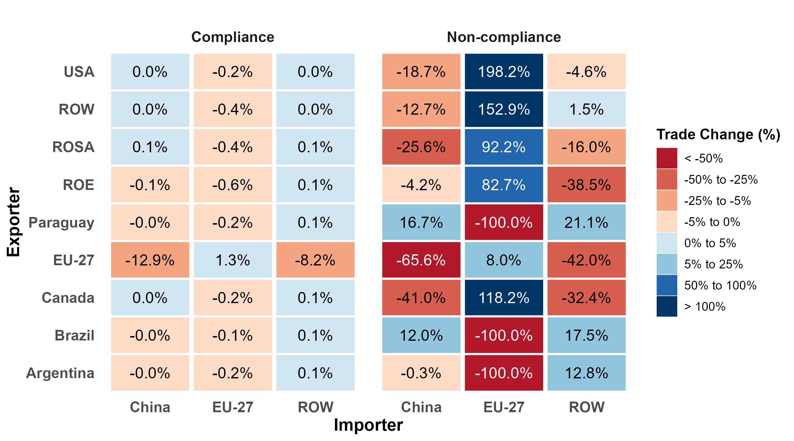{#fig-soybean_diversion}
[Figure 3]{#figure3}: Trade reallocation effect of the EUDR in soybean trade under compliance and non
compliance scenarios. The figure shows the percentage change in exports from the countries and 
regions in the rows to China, the EU, and the rest of the world (ROW) relative to a baseline 
without the EUDR. Red denotes a reduction in exports; blue denotes an increase. ROSA: Rest of South America, ROE: Rest of Europe


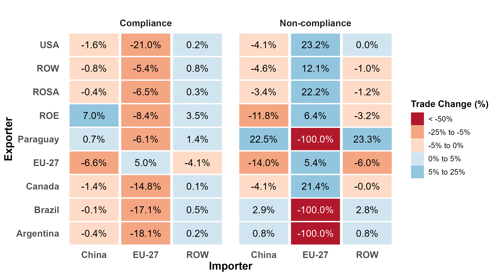{#fig-soyoil_diversion}
[Figure 4]{#figure4}: Trade reallocation effect of the EUDR in soybean oil trade under compliance and non
compliance scenarios. The figure shows the percentage change in exports from the countries and 
regions in the rows to China, the EU, and the rest of the world (ROW) relative to a baseline 
without the EUDR. Red denotes a reduction in exports; blue denotes an increase. ROSA: Rest of South America, ROE: Rest of Europe

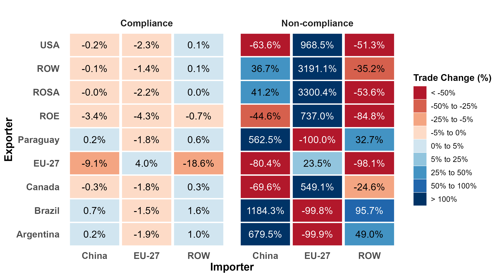{#fig-soycake_diversion}
[Figure 5]{#figure5}: Trade reallocation effect of the EUDR in soybean oilcake trade under compliance and non
compliance scenarios. The figure shows the percentage change in exports from the countries and 
regions in the rows to China, the EU, and the rest of the world (ROW) relative to a baseline 
without the EUDR. Red denotes a reduction in exports; blue denotes an increase. ROSA: Rest of South America, ROE: Rest of Europe


## The US and Canada export increase substantially to the EU if restrictions target BAP

In the non-compliance scenario, there is a significant shift of exports to the EU market from the US and Canada. US soybean exports to the EU rise by 198.2%, while Canadian exports increase by 118.2%. Soybean oil exports from both countries grow by about 22-23%. The most dramatic changes are seen in soybean cake exports, with US exports soaring by 968.5% and Canadian exports by 549.1%. This surge is driven by the EU’s large share of the global import market (32.16%, or USD 10,989.3 million), with Brazil and Argentina the top suppliers of soybean cake to the EU with around 65% share of the EU imports. 

## The EU faces rising prices and declining terms of trade  

As illustrated in Figure 6, the EU would bear substantial expenditure loss if BAP do not comply with the EUDR. Among the three products, the EU experiences the highest welfare losses in soybeans, followed by soybean cake and soybean oil. In the soybean trade, EU expenditure losses can reach \$18,179.84 million, accompanied by average price increases of 60.26%. The EU could face expenditure losses to $1357.54 million for soybean oil and from \$16481.93 million for soybean cake. The economic burden is disproportionately concentrated among major European importers, which have larger relative shares of imports (see [appendix figure A4.2](#figurea42)). Spain, the Netherlands, Italy, and Germany face the most significant expenditure losses in soybeans. Similarly, these countries, along with Poland, France, Denmark, and Belgium, experience the highest expenditure losses in soybean cake and soybean oil. Most EU countries experience expenditure losses, increases in producer prices, and increases in price indices but experience decreases in terms of trade (see [appendix A5.1(d)](#figurea61)). This indicates that the EU lacks sufficient market leverage to benefit from import restrictions, as it remains heavily dependent on imports.

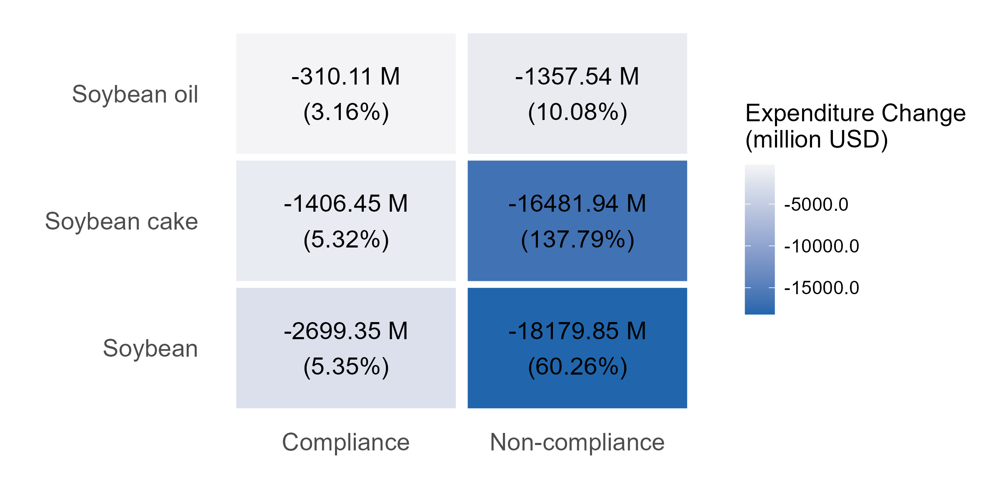{#fig-n1}
Figure 6: Expenditure loss (million USD) faced by EU27 under the EUDR
simulation. The loss is measured relative to the baseline without the EUDR. The percents in parenthesis denote average of change in price index in the EU countries.

Note: The expenditure loss is measured as $[\frac{\widetilde{E_i^{CFL}}}{\widetilde{P_i^{CFL}}} - \frac{\widetilde{E_i^{BLN}}}{\widetilde{P_i^{BLN}}}]$.

## Import restrictions could boost demand for soy products from target countries

Our analysis reveals no significant change in total exports from target countries under either scenario (see [figure A5.4](#a64)). This results reflects the short-run nature of our simulation, which holds total output and expenditures constant and assumes zero supply elasticity. Notably, the decline in producer prices for Brazil, Argentina and Paraguay points to increased export competitiveness driven by lower prices. We further confirm this by keeping supply constant for each country but allowing expenditures to change. Under these conditions, we find significant export growth (see [figure A5.3](#a63)). Soybean exports increased by 7.4% for Brazil, 3.1% for Argentina, and 4.8% for Paraguay, directly resulting from lower producer prices in these countries. The effects emerged pronounced in soybean cake exports, with increases of 69.6% for Argentina, 106.3% for Brazil, and a surge of 93.2% for Paraguay. Moreover, soybean oil exports showed minimal growth across these countries, increasing by less than 0.5%.

## BAP face decrease in price index of soybean, but some declines in terms of trade

[Figure 7](#figure7) illustrates the effects of the EUDR on exporting countries. In the soybean and soybean oil, BAP experiences declines in price indexes and producer prices, however they see little to no change in terms of trade. However, for soybean cake, BAP see increase in price index and decrease in terms of trade illustrates the effects of the EUDR on major soy traders. In soybeans and soybean oil, BAP experiences a decline in price indexes and producer prices; however, it sees little to no change in terms of trade. In soybean cake, Paraguay and Argentina see an increase in price index and producer price, while Brazil sees a decrease in both prices.

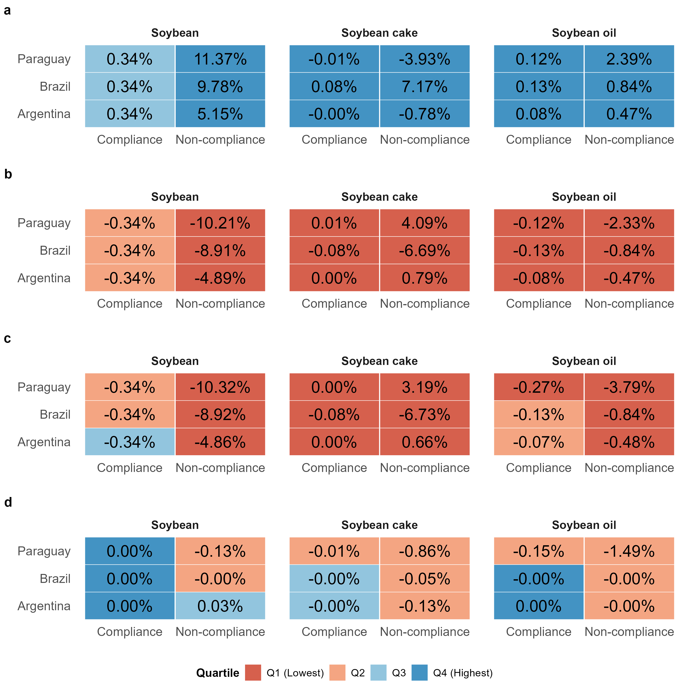

[Figure 7]{#figure7}: Changes in indices under compliance and non-compliance scenarios relative to a baseline without the EUDR. Quartile is measured at the scenario-product level for each index. (a) percentage change in welfare. (b) percentage change in producer price. (c) percentage change in price index (d) percentage change in terms of trade


# Sensitivity checks

Our exercise is purely an ex‑ante assessment of the regulation based on the 2022 base year. For credibility and robustness, we (i) check the effects of compliance AVEs. For example, in the compliance case, we impose a 6% AVE compliance cost, which yields a tentatively similar increase in the EUDR price index (see [figure A5.1(b)](#figurea61)). This verifies that our compliance scenario represents what we simulate. For the non‑compliance scenario, our chosen AVE estimates effectively shut down exports from BAP to the EU, as evidenced by Figures 3, 4, and 5. (ii) We report sensitivity over plausible lower and upper bounds of 2% and 10% AVE and Armington elasticities at the lower and upper bounds of the 95% confidence intervals. Across these ranges, the qualitative results are stable (see [appendix A6](#app-a7)): EU substitution toward compliant suppliers and diversion of displaced South American volumes to non‑EU destinations. Higher AVEs predictably amplify EU price index increases and welfare losses, but do not overturn the direction of reallocation.

# Discussions 

Our analysis indicates that the EUDR faces notable limitations in reducing exports that drive tropical deforestation linked to the soy sector. The direct competitors to South American soy exporters are the US and Canada, which are largely deforestation-free producers and redirect their exports to the EU under the EUDR implementation. As a result, the soy supply restricted from BAP is reallocated to China. These patterns align with the well-documented effects of the NTMs: trade reduction between compliant and non-compliant pairs, while facilitating trade among compliant origins [@fontagne2005; @santeramo2019; @santeramo2025]. Particularly, the trade reallocation we observe is a canonical response to unilateral NTMs implemented by importers that are not the dominant buyer for targeted exporters: restricted supply absorbed by third markets, while the import market under the compliance turns to compliant suppliers.

With the EUDR in place, the trade pattern indicates two segregated supply chains: first, the EU can import verifiable deforestation-free soy from North America and, to a limited extent, from South America, where supplies are already deforestation-free.^[Brazil’s soy sector has long‑running zero‑deforestation efforts. In the Amazon, the Soy Moratorium- implemented by firms handling ~90–95% of exports- was associated with a 57% reduction in direct soy‑deforestation in treated municipalities; in the Cerrado, several traders have adopted ZDCs but implementation and coverage remain incomplete [@gollnow2022].] Actually, this partial compliance of South America represents the distributional consequences. Smallholders and smaller firms would lose access to the EU market. Nevertheless, this compliance supply chain represents a small fraction of the total supply chain (~15%). Consequently, with the changed composition of the destination market, the pressure on deforestation in South America does not necessarily decrease. Even with full compliance of South American soy targeted at the EU market, particularly from Brazil, it does not guarantee a reduction in deforestation, as long as the demand pressure for soy from the non-EU market remains constant. Evidence of substantial domestic leakage within Brazil, on the order of 43–50%, suggests that reductions in deforestation in some locations can be offset by increases elsewhere [@villoria2022].

Second, a conventional supply chain serving the non-EU market (notably China) without compliance requirements.  The increasing reliance of South America on the Chinese market may further erode the EU’s leverage in promoting environmental compliance in the future. Understanding the long-term consequences of these trade reallocation patterns is therefore important. In our baseline EUDR simulation, producer prices in BAP fall, and constrained volumes are reallocated toward China. Over longer horizons, the net effect on production and land use in high-risk areas depends on the magnitude and persistence of the price signal, supply elasticities, and how fully China/ROW) absorb displaced flows. Because the EU accounts for a relatively small share of BAP exports, an EU‑only signal may be too weak to induce contraction; if China’s demand expansion keeps producer prices near baseline, output could be sustained, and deforestation pressures may persist or even rise, raising the prospect of a fragmented global soy market less responsive to EU regulations.

The economic implications for the EU are substantial. Certain EU members, such as the Netherlands, Poland, Spain, Germany, France, and Italy, bear disproportionate burdens, reflecting differences in import dependency, processing capacity, and supply chain integration. @gilbert2024 discusses that this creates a "European premium" over world prices, with compliance costs directly passed to EU consumers. Further, the loss is also pronounced in soybean cake, despite its lower share in global soy trade, which is due to the higher elasticity of substitution for soybean cake. This result is consistent with the studies by @branger2014 and @bohringer2017, which show that higher trade elasticities increase trade reallocations. According to @vannoordwijk2025, the EUDR may cause "collateral damage" to unintended stakeholders. For example, in our analysis, restrictions on BAP increase welfare losses in the US and Canada due to an increase in the price index.

The EUDR, similar to non‑tariff measures, appears as both a trade catalyst and a barrier. For forest‑risk countries, it functions as a trade barrier, as these countries will be under higher scrutiny and compliance costs could rise. However, the EUDR can catalyse trade within the EU; this provides an opportunity for soy producers and producers of substitute products, such as other vegetable oils and cake, from EU countries. This is evidenced by increased producer prices for soy products in EU countries (see [appendix figure A5.1](#figurea61)). Trade between compliers (most likely North American exporters) and the EU also rises. This finding is in line with @santeramo2025, which highlights that the EU TBT has the capacity to redirect imports towards compliant origins.

Our findings on the consequences of the EUDR simulation underscore the limitations of a purely demand-side regulatory. A more effective approach would combine demand-side and supply-side measures, including direct forest conservation incentives, carbon payments, and Contingent Trade Agreements (CTAs) that penalize exporters based on changes in forest cover. @muradian2025 argue that territorial approaches, such as Brazil's Amazon Soy Moratorium and the Action Plan for the Prevention and Control of Deforestation in the Legal Amazon (PPCDAm), have been more effective in reducing deforestation by aligning with local public governance. In contrast, the EUDR's focus on value chain interventions fails to address underlying drivers of deforestation, such as weak governance and land speculation. @harstad2024b also emphasizes the importance of balancing depth and breadth in environmental agreements. The EUDR, as a "deep-but-narrow" policy, imposes strict deforestation-free requirements on imports but applies only to the EU market. A "broader-but-shallow" agreement involving multiple major importers with less ambitious regulations could reduce leakage and achieve greater global impact. For instance, a CTA between the EU and the US could potentially reduce agricultural expansion in Brazil by up to 27% compared to unrestricted free trade scenarios [@harstad2024a; @harstad2024c].


# Conclusion

The EUDR is the EU's first regulatory initiative to curb tropical deforestation through trade restrictions on the soy sector. We fitted the gravity model, taking the base year 2022, and assessed the effects of the EUDR under two scenarios: one in which exporters comply with the regulation and another in which BAP do not export soy to the EU. We chose these three countries for the non-compliance scenario because they have faced significant forest loss directly attributable to soybean expansion, are characterized by weak environmental governance, and hold a substantial share of global soy production. Our results show that restrictions on South American exports redirect soy flows toward China, while EU imports are substituted by US and Canadian suppliers. The EU experiences expenditure losses due to increased prices arising from compliance costs, leading to deteriorated terms of trade. The expenditure losses are even more severe when South American countries do not comply with the EUDR. Conversely, South American countries face declining soy price indices and producer prices with no change in terms-of-trade effects. These findings suggest that the EU lacks sufficient market leverage to incentivize pro-forest land use decisions in major South American soy producers.

We acknowledge some limitations in our study. Our results are under "conditional" equilibrium in the sense of @anderson2018, which captures short-run and static trade reallocation and price index effects of the EUDR. This model falls short in offering a discussion on long-run environmental impacts, including endogenous output responses in major producing countries, EU domestic supply responses, and cross-commodity substitution in the vegetable oils complex (e.g., palm, sunflower, rapeseed). Importantly, the model also abstracts from substitution from soybeans toward other oilseeds, which could, for example, shift deforestation from tropical soy production areas to oil palm regions such as Indonesia. If Chinese demand contracts in the future and does not fully absorb the restricted supply, production by South American producers could contract, leading to increased avoided deforestation relative to our short-run benchmarks. Modeling these channels requires a multi-sectoral equilibrium framework with endogenous supply responses, which is beyond the scope of this paper. Finally, we do not model heterogeneous compliance capacity (e.g., partial compliance by larger firms with exclusion of smaller producers) or subnational leakage dynamics within Brazil; as a result, country-level “avoided deforestation” inferences should be interpreted cautiously. A subregional trade–land-use model linking destination-specific demand to producing meso-regions would be better suited to assess how EUDR-induced demand shifts affect frontier expansion versus consolidated, low-forest areas.

While our study focuses on the soy sector, future research should also examine the trade reallocation and the possible deforestation leakage for commodities covered by the EUDR, such as palm oil, rubber, cattle, cocoa, coffee, and wood products. Further evidence and robust measurements of environmental effectiveness are warranted, particularly in measuring deforestation leakage and indirect land use changes. Furthermore, governance and implementation challenges, such as traceability and interactions with local governance, deserve research attention to ensure the regulation's success.

\newpage

# References {.unnumbered}

::: {#refs}
:::

\newpage
## Appendix (for online publication) {.unnumbered} 

## A1. Selection of countries {#app1 .unnumbered}

We included 90 countries in the simulation exercise. However, Saudi Arabia (SAU) and Panama 
(PAN) were removed from the soybean analysis, seven countries (ARE, ISL, KEN, MUS, MNE, 
OMN, DZA) were removed from the soybean cake analysis, and two countries (ISL, GAB) were 
removed from the soybean oil analysis. These countries were selected because they are either 
significant producers or consumers of soy products.

These countries are selected because they are either significant producers or consumers of soy products. The selected countries are: United Arab Emirates (ARE), Argentina (ARG), Australia (AUS), Austria (AUT), Belgium (BEL), Bulgaria (BGR), Bolivia (BOL), Brazil (BRA), Canada (CAN), Switzerland (CHE), Chile (CHL), China (CHN), Colombia (COL), Costa Rica (CRI), Cyprus (CYP), Czech Republic (CZE), Germany (DEU), Denmark (DNK), Algeria (DZA), Egypt (EGY), Spain (ESP), Estonia (EST), Finland (FIN), France (FRA), Gabon (GAB), United Kingdom (GBR), Greece (GRC), Hong Kong (HKG), Croatia (HRV), Hungary (HUN), Indonesia (IDN), India (IND), Ireland (IRL), Iran (IRN), Iceland (ISL), Italy (ITA), Jordan (JOR), Japan (JPN), Kenya (KEN), Cambodia (KHM), South Korea (KOR), Laos (LAO), Lebanon (LBN), Sri Lanka (LKA), Lithuania (LTU), Luxembourg (LUX), Latvia (LVA), Morocco (MAR), Madagascar (MDG), Mexico (MEX), North Macedonia (MKD), Malta (MLT), Myanmar (MMR), Montenegro (MNE), Mozambique (MOZ), Mauritius (MUS), Malaysia (MYS), Nicaragua (NIC), Netherlands (NLD), Norway (NOR), New Zealand (NZL), Oman (OMN), Panama (PAN), Peru (PER), Philippines (PHL), Poland (POL), Portugal (PRT), Paraguay (PRY), Romania (ROU), Russia (RUS), Saudi Arabia (SAU), Singapore (SGP), El Salvador (SLV), Serbia (SRB), Slovakia (SVK), Slovenia (SVN), Sweden (SWE), Thailand (THA), Trinidad and Tobago (TTO), Turkey (TUR), Taiwan (TWN), Ukraine (UKR), Uruguay (URY), United States (USA), Venezuela (VEN), Vietnam (VNM), South Africa (ZAF), Zimbabwe (ZWE), Kazakhstan (KAZ), and Ecuador (ECU).

\newpage

## A2. Structural Gravity {#str2 .unnumbered}

To analyze the potential effects of the EUDR on global soy trade, we employ the procedure developed by @anderson2018, which is grounded in the structural gravity framework of Anderson and van Wincoop [@anderson2003]. In this framework, the  bilateral trade flows ($X_{ijt}$) of soy products at time $t$, where $i$ denotes exporters and $j$ denotes importers, are a function of the economic size of the partner countries and the costs associated with trade. The gravity equation is given by:

$$
X_{ijt} = \frac{Y_{it} E_{jt}}{Y_t} \left( \frac{t_{ijt}}{\Pi_{it} P_{jt}} \right)^{1-\sigma}, \quad{(A1.1)}
$$

where ($Y_{it}$) is the total soy supply from the exporter $i$, ($E_{jt}$) is the total soy expenditure of importer $j$, and ($Y_t$) is total world production/consumption of soy. The parenthetical term captures trade costs, including bilateral trade cost ($t_{ijt}$) and multilateral resistance terms: outward multilateral resistance (OMR, $\Pi_{it}$) and inward multilateral resistance (IMR, $P_{jt}$). These resistance terms are expressed as follows:

$$
\Pi_{it}^{1-\sigma} = \sum_j \left( \frac{t_{ijt}}{P_{jt}} \right)^{1-\sigma} \frac{E_{jt}}{Y_t}, \quad{(A1.2)}
$$ 

$$P_{jt}^{1-\sigma} = \sum_i \left( \frac{t_{ijt}}{\Pi_{it}} \right)^{1-\sigma} \frac{Y_{it}}{Y_t}. \quad{(A1.3)}$$

These equations illustrate how global trade patterns are interconnected. For example, when China imposed a 25% retaliatory tariff on US soybeans in 2018, the resulting increase in trade costs between the US and China directly reduced their bilateral trade. At the same time, trade between China and Brazil increased, as the relative trade cost between these two countries fell. Such relationships are captured by the trade cost term $t_{ijt}$ within the OMR and IMR, reflecting how changes in trade costs in one bilateral relationship can affect trade flows across many country pairs.

Following @silva2006, equation (A1) can be expressed in multiplicative form as:

$$X_{ijt} = \exp\left(\alpha_{it} + \alpha_{jt} + \alpha_{ij} + \sum_{k=1}^n \alpha_k d_{k,ijt}\right) \epsilon_{ijt}, \quad{(A1.4)}$$ 

where, bilateral trade cost ($t_{ijt}^{1-\sigma}$) is captured by $\exp\left(\alpha_{ij} + \sum_{k=1}^n \alpha_k d_{k,ijt}\right)$, incorporating both time-invariant costs (e.g., geographic distance, contiguity) through $\exp(\alpha_{ij})$ and $k$ number of time-varying costs (e.g., tariffs, trade agreements) through $d_{k,ijt}$. Baier and Bergstrand [-@baier2007] emphasize to include country-pair fixed effects ($\alpha_{ij}$) which captures time-invariant factors sepific to each country pair. These fixed effects also address the potential by accounting for unobserved, long-term factors such as historical trade relationships that might otherwise bias the estimates. The term $\exp(\alpha_{it} + \alpha_{jt})$ represents exporter-time and importer-time fixed effects, corresponding to $\frac{Y_{it} E_{jt}}{Y_t} \left(\frac{1}{\Pi_{it} P_{jt}}\right)^{1-\sigma}$. As Feenstra [-@feenstra2002] suggests, these fixed effects capture OMR, IMR, and market sizes, that vary by exporter-year and importer-year level. Santos Silva and Tenreyro [-@silva2006] recommend estimating equation (4) using the pseudo-Poisson maximum likelihood (PPML) approach, which allows including zero trade flows in the dependent variable. In addition, this leads to unbiased and consistent estimation of parameter under heteroskedasticity. 

For the conditional counterfactual study, we decompose the equation (A1.1) for the base year 2022 as follows:[]{#app14}
$$
\Delta X_{ij}^s = (1-\sigma_s)[\Delta t_{ij}^s - \Delta \Pi_i^s -\Delta P_j^s], \quad{(A1.4)}
$$
\newpage

## A3. Armington elasticies {#arm3 .unnumbered}

```{r}
#| out-width: "100%"
#| fig-cap: "" 

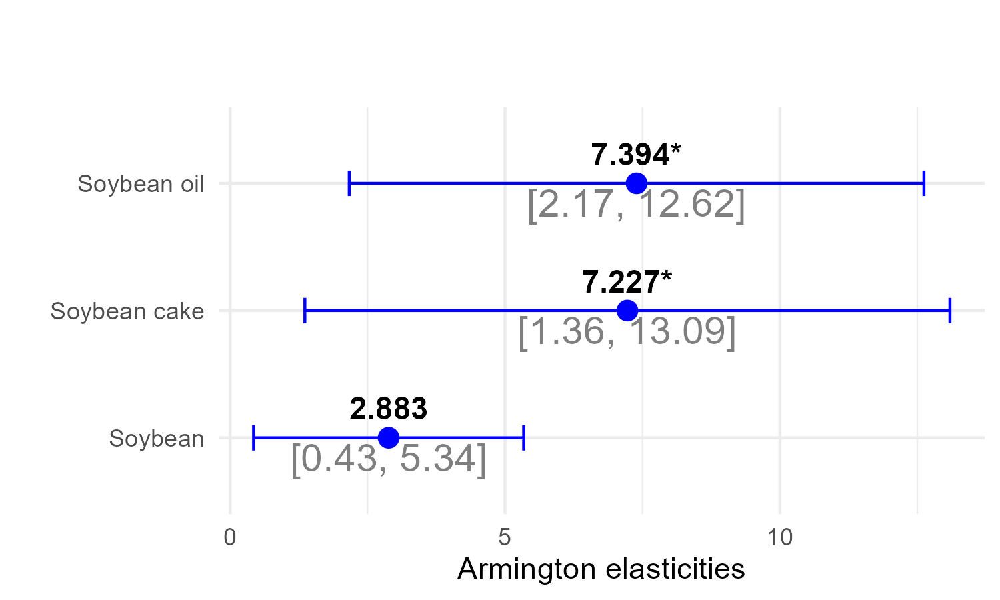
```
Figure A3.1: Estimates of Armington elasticites with 95% condidence intervals. Note: Armington elasticities are defined as 1 minus tariff elasticities. We estimate tariff elasticities using the pseudo-Poisson maximum likelihood (PPML) estimator. Exporter-year, importer-year, and country-pair fixed effects are included. Standard errors are clustered at the country-pair level. *** p<0.001, ** p<0.01, * p<0.05, . p<0.1

\newpage

## A4. EU involvement with soy trade {.unnumbered}

[Table A4.1]{#table41}: Import share of EU-27 countries in soy products (2021-2023)

```{r, echo = FALSE}
import_share_EU <- readRDS("data/import_share_EU.rds")

flextable(import_share_EU) %>%
  set_header_labels(
    exporter = "Selected Countries",
    import_share = "Import Share of EU-27 (%)",
    share_EU = "Export Share to EU-27 (%)",
    global_share = "Export Share to World (%)"
  ) %>%
  theme_vanilla() %>%
  colformat_double(j = c("import_share", "share_EU", "global_share"), digits = 2) %>%
  fontsize(size = 11, part = "header") %>%
  fontsize(size = 9,  part = "body")   %>%  
  fit_to_width(max_width = 7.5)
```
Source: Own estimation based on CEPII-BACI database [@gaulier2010]


\newpage

```{r}
#| out-width: "100%"
#| fig-cap: "" 

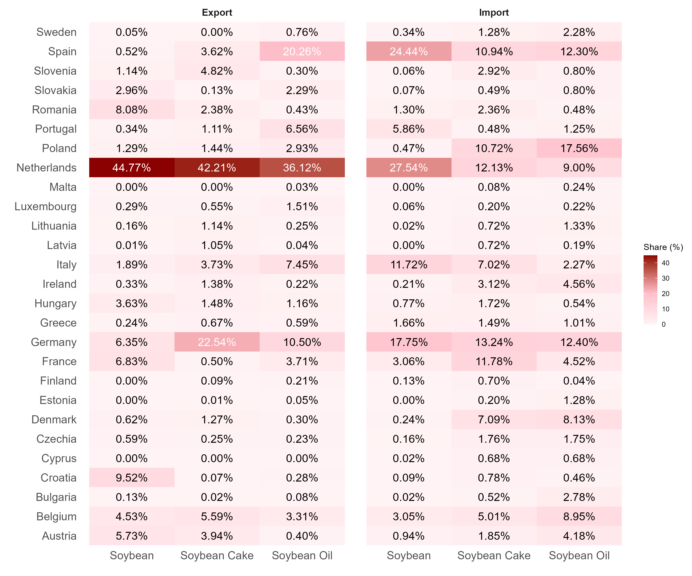
```
[Figure A4.2]{#figurea42}: Relative sizes of the EU countries (among themselves) in import and export markets (cumulative 2019-2021)

*Note:* Percentages denote the EU countries' share of total EU27 imports and exports.


\newpage

# A5. Additional results of the EUDR simulation {.unnumbered}

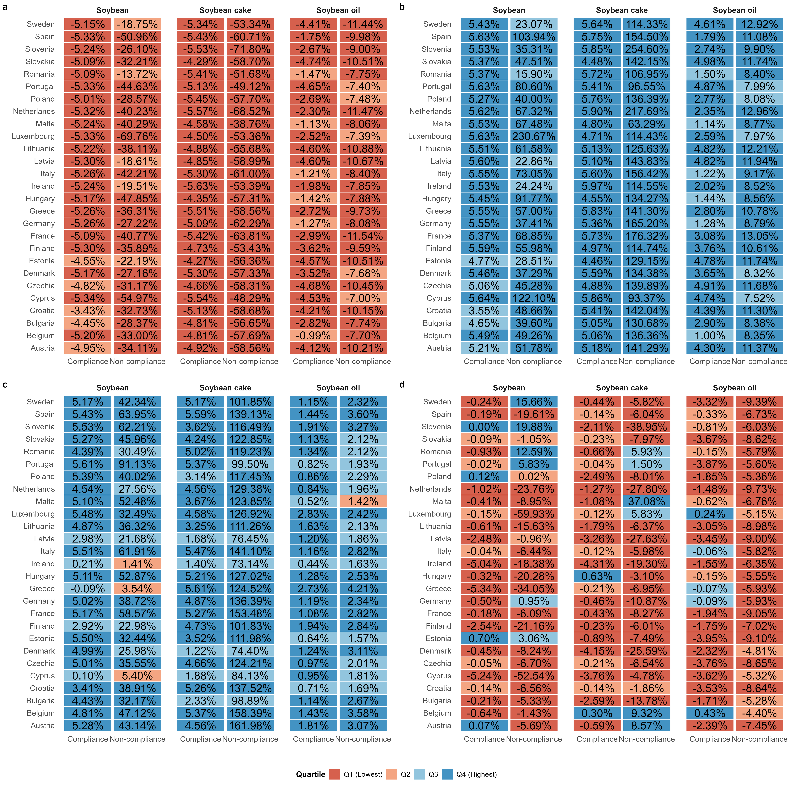

[Figure A5.1]{#figurea61}: Effects of the EUDR on the EU countries, relative to a baseline without the EUDR. (a) Welfare changes (b) Price index changes (c) Producer price changes (d) Terms of trade change. Quartiles are measured at the scenario-product level.

\newpage

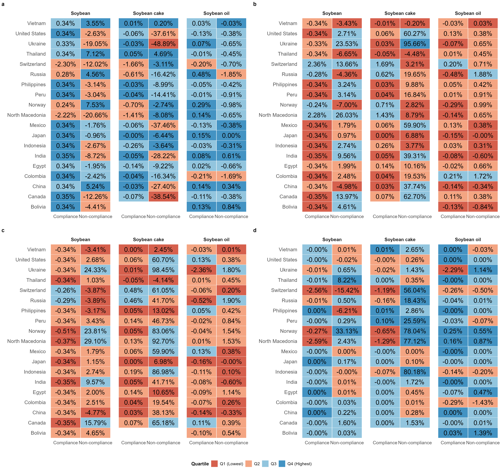

[Figure A5.2]{#figure62}: Effects of the EUDR on the selected countries, relative to a baseline without the EUDR. (a) Welfare changes (b) Price index changes (c) Producer price changes (d) Terms of trade change. Quartiles are measured at the scenario-product level.

\newpage

```{r}
#| out-width: "100%"
#| fig-cap: "" 

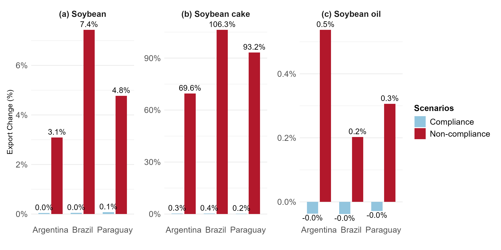
```

[Figure A5.3]{#a63}: Change in exports from BAP assuming that supply remains constant, relative to a baseline without the EUDR. Quartiles are measured at the scenario-product level. The compliance and non-compliance scenarios are denoted by Com. and Non-com.

\newpage

```{r}
#| out-width: "100%"
#| fig-cap: "" 

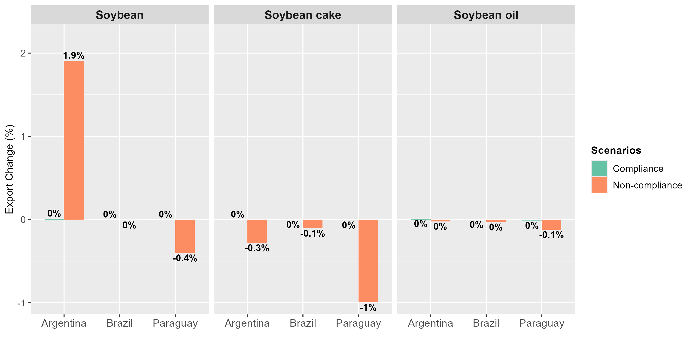
```

[Figure A5.4]{#a64}: Change in exports from BAP with both supply and expenditure held constant, relative to a baseline without the EUDR. Quartiles are measured at the scenario-product level.

\newpage

## A6. Sensitivity analysis {#app-a7 .unnumbered}

```{r}
#| out-width: "100%"
#| fig-cap: "" 

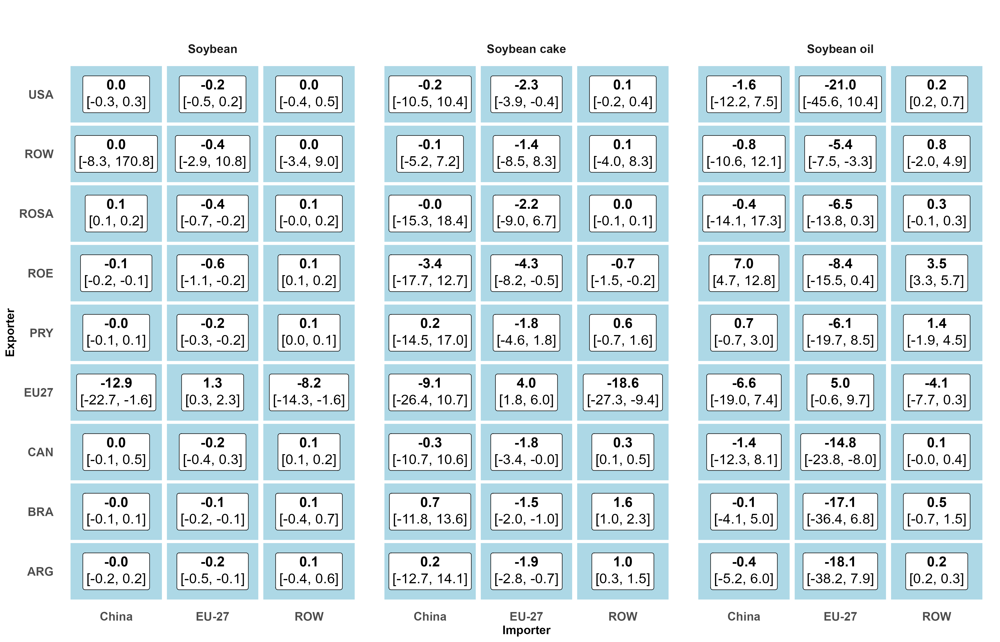
```

Figure A6.1: Sensitivity check under the compliance scenario. The left value in brackets denotes the minimum and the right value denotes the maximum across nine sub-scenarios, defined by three compliance cost levels (low, medium, and high) under lower, baseline, and upper-bound Armington elasticities. The bold value indicates the change in exports relative to the 2022 baseline without the EUDR, evaluated under the medium compliance cost and baseline Armington elasticities. “Low,” “medium,” and “high” compliance correspond to 2%, 6%, and 10% ad valorem tariff-equivalent compliance costs for EU imports, respectively.

\newpage
```{r}
#| out-width: "100%"
#| fig-cap: "" 

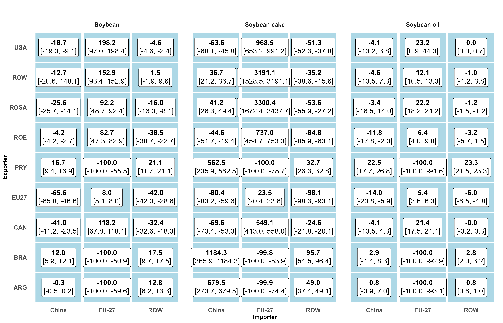
```
Figure A6.2: Sensitivity check under non-compliance. The left value in brackets denotes the minimum and the right value denotes the maximum across nine sub-scenarios, defined by three compliance cost levels (low, medium, and high) under lower, baseline, and upper-bound Armington elasticities. The bold value indicates the change in exports relative to the 2022 baseline without the EUDR, evaluated under the medium compliance cost and baseline Armington elasticities. “Low,” “medium,” and “high” compliance correspond to 2%, 6%, and 10% ad valorem tariff-equivalent compliance costs for EU imports, respectively.
\newpage

```{r}
#| out-width: "100%"
#| fig-cap: "" 

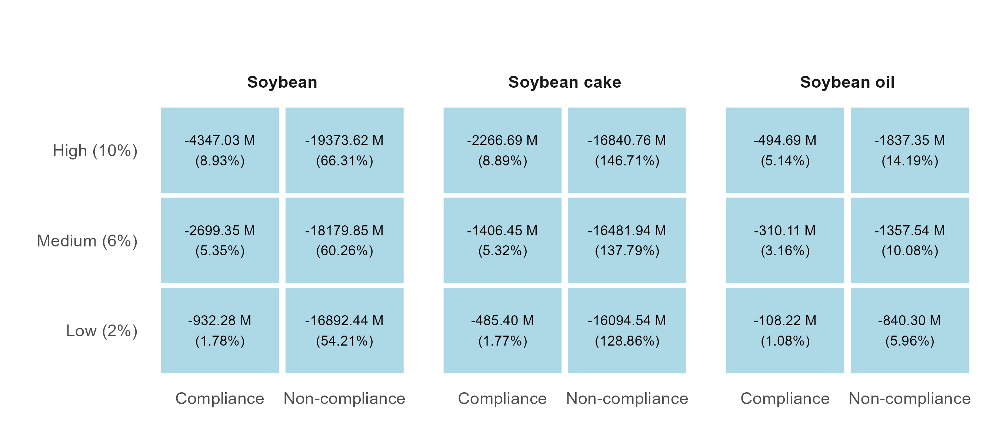
```
Figure A6.3: Sensitivity check for expenditure change under different compliance cost. Changes in expenditures are measured relative to the baseline year 2022 without the EUDR. Lower, medium and higher compliance denote 2%, 6% and 10% ad valorem tariff-equivalent compliance costs for EU imports.

\newpage

```{r}
#| out-width: "100%"
#| fig-cap: "" 

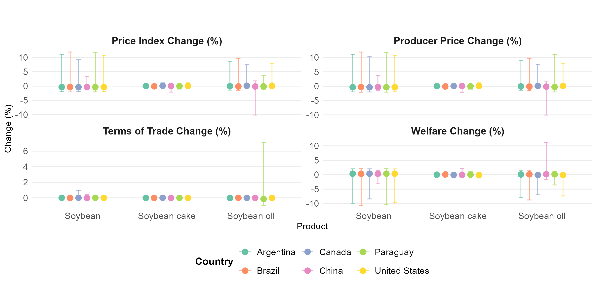
```
Figure A6.4: Sensitivity check for indexes under compliance. Changes in indexes are measured relative to the baseline year 2022 without the EUDR. Points in the error bar represents indices change evaluated under the medium compliance cost and baseline Armington elasticities. Error bars represents minimum and maximum across across nine sub-scenarios, defined by three compliance cost levels (low, medium, and high) under lower, baseline, and upper-bound Armington elasticities

\newpage

```{r}
#|
#| out-width: "100%"
#| fig-cap: "" 

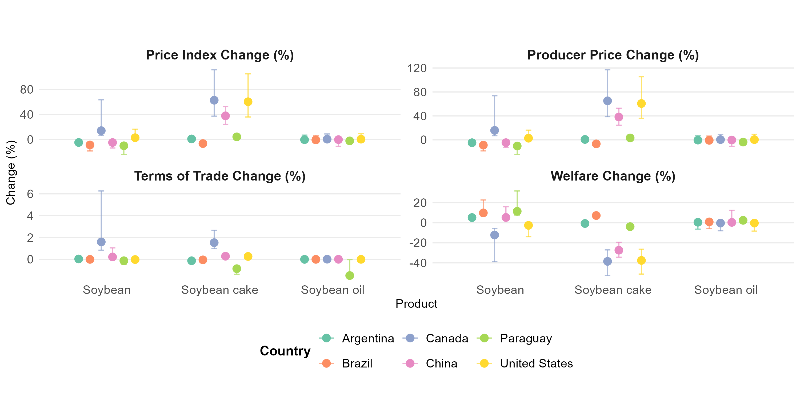
```

Figure A6.5: Sensitivity check for indexes under non-compliances. Changes in indexes are measured relative to the baseline year 2022 without the EUDR. Points in the error bar represents indices change evaluated under the medium compliance cost and baseline Armington elasticities. Error bars represents minimum and maximum across across nine sub-scenarios, defined by three compliance cost levels (low, medium, and high) under lower, baseline, and upper-bound Armington elasticities.
